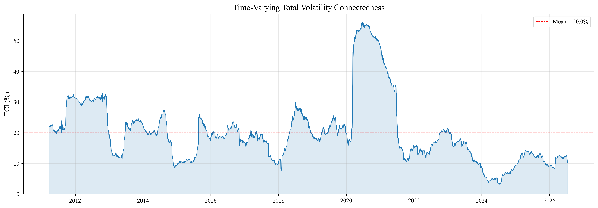
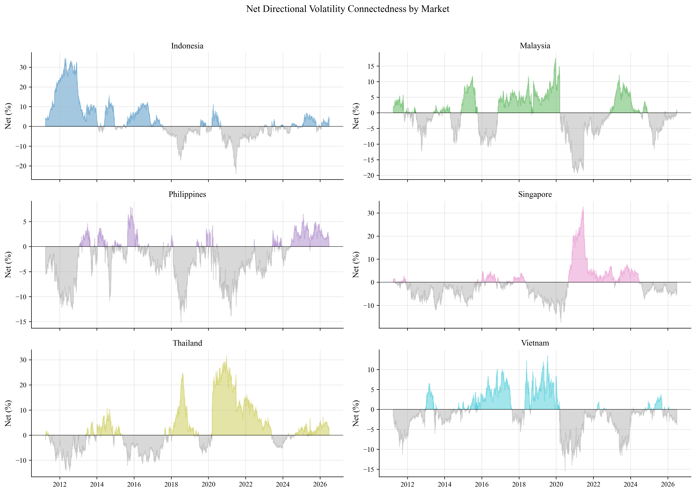
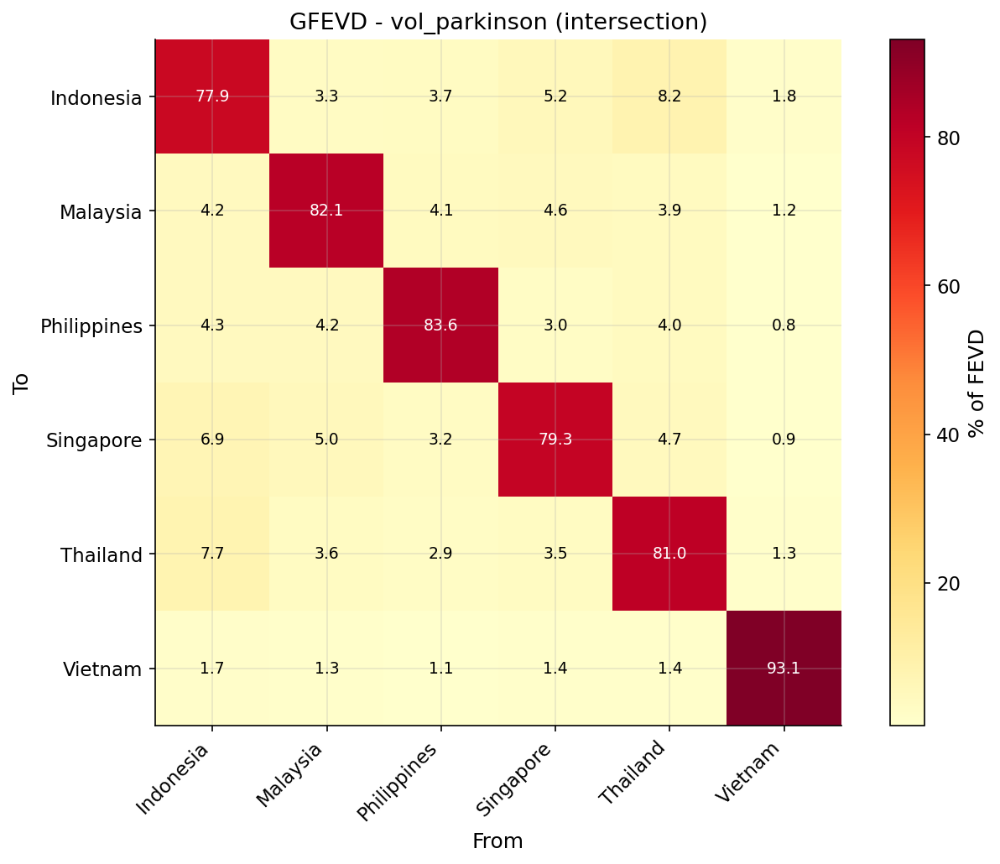
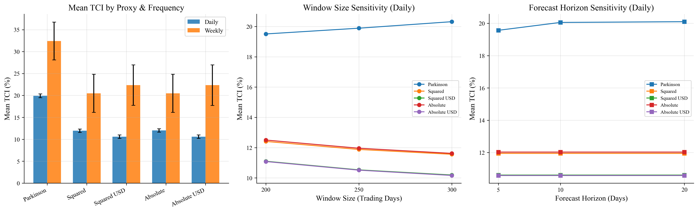
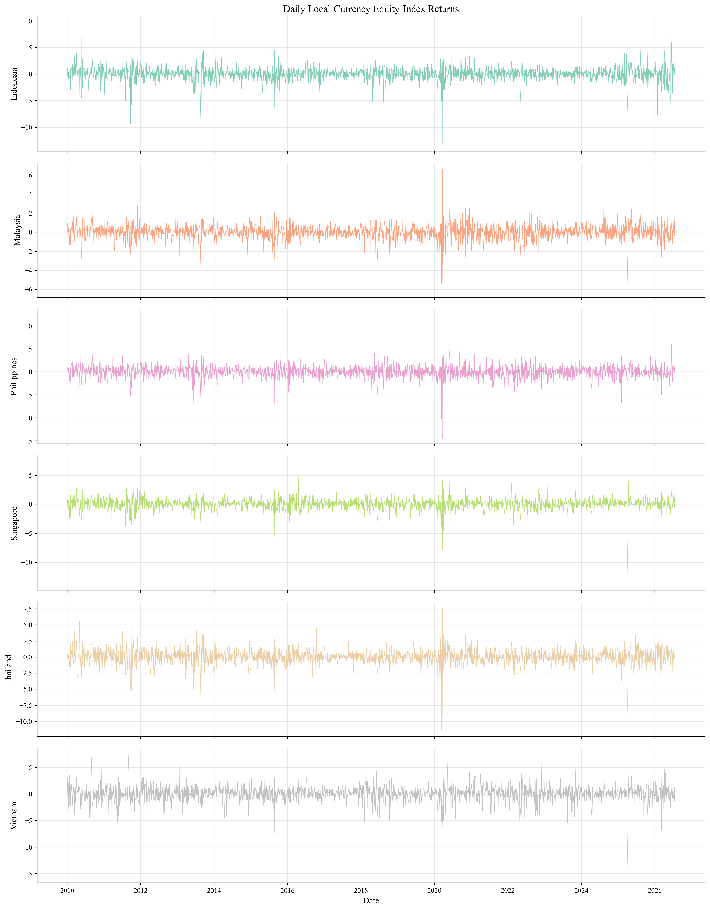
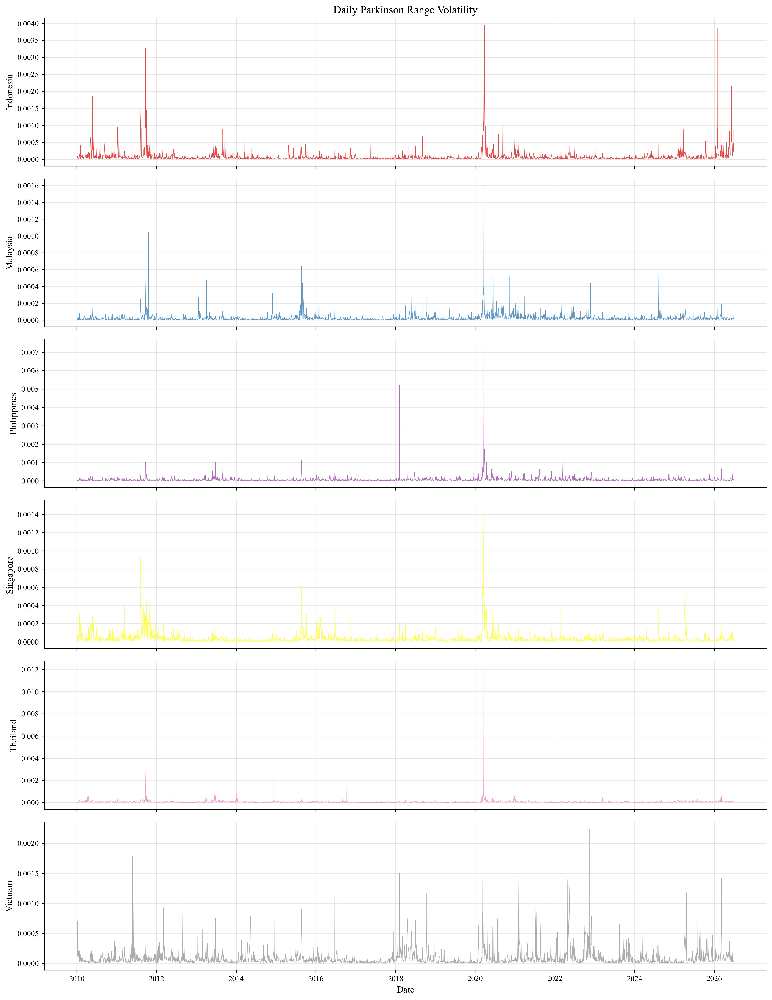

::: center
**Time-Varying Volatility Connectedness among ASEAN Equity Markets:\
Evidence from Global Geopolitical and Macroeconomic Shocks**
:::

# Introduction

The increasing integration of ASEAN economies has expanded opportunities
for cross-border investment, financing, and risk sharing. At the same
time, closer financial links can provide channels through which shocks
originating in one market are transmitted to others. This tension is
especially important in Southeast Asia, where equity markets differ
substantially in size, liquidity, foreign-investor participation,
exchange-rate exposure, and institutional development. A disturbance
that is absorbed locally in one market may therefore produce persistent
regional effects in another.

The period since 2010 provides a particularly useful setting in which to
examine these linkages. ASEAN markets have experienced the consequences
of the European sovereign-debt crisis, the taper tantrum, trade tensions
between the United States and China, the COVID-19 pandemic, Russia's
invasion of Ukraine, rapid monetary tightening in advanced economies,
and renewed geopolitical instability. These episodes affected global
risk appetite, funding conditions, commodity prices, and international
capital flows. However, the existence of common global shocks does not
imply that all ASEAN markets transmit or absorb risk in the same way.
Identifying the direction of transmission is therefore as important as
measuring its overall magnitude.

Existing evidence documents important linkages between Asian equity
markets and shows that market openness is related to exposure to
external volatility [@Chow2017]. Research focused on ASEAN also finds
significant volatility transmission from the United States
[@VoTran2020], while evidence for Vietnam indicates meaningful linkages
with advanced markets [@VoEllis2018]. Recent studies have moved closer
to the present setting. @SethapramoteEtAl2023 examine dynamic
connectedness between ASEAN and global equity markets during COVID-19,
while @AlAnshari2025 studies the evolution of an ASEAN-6 network,
including Vietnam, using correlation- and graph-based methods. Work on
categorical policy uncertainty further demonstrates that the magnitude
and direction of ASEAN connectedness depend on the source and timing of
uncertainty [@HoqueEtAl2026]. Consequently, the remaining gap is not the
absence of ASEAN network evidence. Rather, three issues remain
unresolved. First, Vietnam's directional role within an internally
focused ASEAN volatility network remains sensitive to how volatility and
market integration are measured. Second, average full-sample estimates
can conceal changes in the identity of net shock transmitters and
receivers across multiple global episodes. Third, high comovement during
turbulent periods should not automatically be described as contagion. As
emphasized by @ForbesRigobon2002, contagion requires an increase in
cross-market linkages following a shock; otherwise, the evidence may
reflect continuing interdependence.

This paper addresses these issues by estimating the dynamic volatility
connectedness of six ASEAN equity markets: Indonesia, Malaysia, the
Philippines, Singapore, Thailand, and Vietnam. The empirical framework
is based on generalized forecast-error variance decompositions from a
vector autoregression (VAR). It measures the share of each market's
forecast-error variance attributable to shocks from every other market,
without making the results dependent on the ordering of variables
[@PesaranShin1998; @DieboldYilmaz2012]. Rolling-window estimation then
reveals changes in regional connectedness and in each market's systemic
role over time.

The paper asks four questions. First, how strongly are volatility shocks
transmitted among ASEAN equity markets? Second, which markets are net
transmitters and which are net receivers of volatility? Third, does
Vietnam's role in the network change across tranquil and turbulent
periods? Fourth, do geopolitical and macroeconomic shocks produce
statistically and economically meaningful increases in regional
connectedness?

The study makes three contributions relative to this literature. First,
it estimates an internally focused ASEAN-6 directional volatility
network over 2010--2026 and evaluates Vietnam's role using range-based
and return-based volatility measures, local- and US-dollar returns, and
daily and weekly frequencies. Second, it tracks changes in both
aggregate connectedness and transmitter--receiver positions across eight
global shock episodes rather than concentrating on COVID-19 alone.
Third, it distinguishes persistent interdependence from shock-associated
increases using fixed event definitions and dependence-preserving
bootstrap inference. These features complement the global-market
emphasis of @SethapramoteEtAl2023 and the correlation- and graph-based
network analysis of @AlAnshari2025.

The remainder of the paper is organized as follows.
Section [2](#sec:literature){reference-type="ref"
reference="sec:literature"} reviews the related literature and develops
the hypotheses. Section [3](#sec:data){reference-type="ref"
reference="sec:data"} describes the data and construction of volatility
measures. Section [4](#sec:method){reference-type="ref"
reference="sec:method"} presents the connectedness framework and the
tests for shock-related changes.
Section [5](#sec:results){reference-type="ref" reference="sec:results"}
sets out the empirical analysis.
Section [6](#sec:robustness){reference-type="ref"
reference="sec:robustness"} describes robustness tests, and
Section [7](#sec:conclusion){reference-type="ref"
reference="sec:conclusion"} concludes.

# Related Literature and Hypotheses {#sec:literature}

## Financial integration, spillovers, and contagion

International financial integration can improve risk sharing and price
discovery, but it can also accelerate the transmission of adverse
information. Spillovers arise when innovations in one market explain
subsequent returns or volatility in another. When such connections are
stable features of an integrated system, they represent interdependence.
In contrast, @ForbesRigobon2002 define contagion in terms of a
significant increase in cross-market linkages after a shock. This
distinction is important because correlations often rise mechanically
when volatility increases. The present study therefore uses
"connectedness" and "spillover" for the general transmission of shocks
and uses "contagion" only when the empirical analysis supports a
discrete or statistically significant increase during a shock period.

ASEAN markets are likely to be linked through several channels. Common
global investors can rebalance portfolios across the region; trade
linkages can transmit changes in expected cash flows; exchange-rate and
commodity-price movements can alter firm values; and global risk
aversion can simultaneously tighten financing conditions. These
mechanisms imply that regional volatility should increase when a global
disturbance changes investors' risk-bearing capacity or information set.

**H1:** Total volatility connectedness among ASEAN equity markets
increases during periods of elevated global geopolitical or
macroeconomic stress.

## Directional and time-varying transmission

Aggregate measures alone cannot identify the source of risk. A market
can receive substantial volatility from the system while contributing
little to other markets, or it can act as a regional transmission hub.
Differences in capitalization, liquidity, openness, and information
processing suggest that directional effects will be heterogeneous.
Moreover, these roles need not be constant. A domestic policy event may
temporarily turn a usual receiver into a transmitter, while a global
shock may strengthen the influence of the most internationally
integrated market.

The connectedness approach of @DieboldYilmaz2012 is well suited to this
question because it separates shocks transmitted *to* a market from
those transmitted *from* it. Its network interpretation also permits
each market to be represented as a node joined by weighted, directed
edges [@DieboldYilmaz2014].

Two recent ASEAN studies provide especially close benchmarks.
@SethapramoteEtAl2023 report that spillovers from global equity markets
to ASEAN increased during COVID-19 and that the contribution of
intraregional ASEAN spillovers also became more important. Using all six
markets examined here, @AlAnshari2025 documents crisis-related changes
in ASEAN-6 correlation and network structure between 2011 and 2024. The
present study differs by modeling volatility rather than return-network
similarity, deriving directional shares from generalized forecast-error
variance decompositions, examining several distinct global episodes, and
formally testing shock-window differences.

**H2:** The magnitude and direction of volatility transmission are
heterogeneous across ASEAN markets and vary over time.

Vietnam is a particularly informative case. Its equity market has become
more integrated with international markets, but differences in market
depth, investor composition, and institutional structure may affect how
it absorbs external information. Rather than assuming a fixed role for
Vietnam, the analysis tests whether it is generally a net receiver and
identifies periods in which that position changes.

**H3:** Vietnam is, on average, a net receiver of volatility shocks
within the ASEAN network, but its net connectedness changes across
market regimes.

## Global uncertainty and regional connectedness

Geopolitical events and macroeconomic policy shifts can affect ASEAN
equities through global risk aversion, interest-rate expectations,
exchange rates, trade, and commodity markets. Prior studies find
meaningful connections between Asian equity volatility and external
shocks [@Chow2017; @VoTran2020]. These effects may be nonlinear:
uncertainty can have modest consequences in normal conditions but large
effects when market liquidity is limited or investors deleverage
simultaneously.

**H4:** Higher global uncertainty is associated with stronger ASEAN
volatility connectedness after controlling for general financial-market
conditions.

# Data and Variable Construction {#sec:data}

## Equity-market data

The sample contains the principal broad equity indices for Indonesia,
Malaysia, the Philippines, Singapore, Thailand, and Vietnam. Daily open,
high, low, and closing index levels were collected from Yahoo Finance,
with the VN-Index supplemented using VNStock. The raw sample runs from
January 4, 2010 to July 17, 2026. Intersecting the six national trading
calendars produces 3,366 common return observations. After requiring
valid high and low prices, the baseline Parkinson-volatility panel
contains 3,343 observations.
Table [1](#tab:markets){reference-type="ref" reference="tab:markets"}
records the market series.

  Country       Index                              Vendor symbol   Currency
  ------------- ---------------------------------- --------------- ----------
  Indonesia     Jakarta Composite Index            JKSE            IDR
  Malaysia      FTSE Bursa Malaysia KLCI           KLSE            MYR
  Philippines   PSE Composite Index                PSEI            PHP
  Singapore     Straits Times Index                STI             SGD
  Thailand      Stock Exchange of Thailand Index   SET             THB
  Vietnam       VN-Index                           VNINDEX         VND

  : Equity-market series {#tab:markets}

::: minipage
*Note:* Vendor symbols can vary across data services. The empirical
files retain the original source, local currency, and raw trading date
for every observation.
:::

Continuously compounded daily returns for market $i$ are calculated as
$$\begin{equation}
 r_{i,t}=100\left[\ln(P_{i,t})-\ln(P_{i,t-1})\right],
 \label{eq:return}
\end{equation}$$ where $P_{i,t}$ is the closing index level. The
baseline volatility proxy is the range-based estimator of
@Parkinson1980: $$\begin{equation}
 v_{i,t}=\frac{1}{4\ln(2)}\left[\ln\left(\frac{H_{i,t}}{L_{i,t}}\right)\right]^2,
 \label{eq:parkinson}
\end{equation}$$ where $H_{i,t}$ and $L_{i,t}$ denote the daily high and
low. The VAR is estimated using $\ln(v_{i,t}+\epsilon)$, where
$\epsilon$ is a small positive constant. Log squared returns and log
absolute returns are used as alternative volatility proxies. Because
national exchanges observe different holidays, the baseline panel
retains only dates common to all six markets; prices are never carried
forward and treated as new information. Local-currency measures form the
baseline, while US-dollar return volatility and weekly observations
provide robustness tests. Weekly high and low prices are respectively
the maximum and minimum within each ISO week, and each week is assigned
a common Friday date.

## Shock and uncertainty variables

The dynamic analysis combines prespecified event windows with continuous
global indicators. Monthly average VIX and geopolitical-risk (GPR)
indices measure financial and geopolitical uncertainty. Brent crude oil
prices, a broad US-dollar index, the S&P 500, and the two-year US
Treasury yield capture commodity, currency, equity, and monetary-policy
conditions. VIX, Brent, Treasury-yield, dollar, and S&P 500 observations
are obtained through the Federal Reserve Economic Data service; the GPR
index is from @CaldaraIacoviello2022. VIX and GPR enter as monthly
averages. Oil, dollar, and S&P 500 variables are end-of-month log
changes in percent, while the Treasury yield is an end-of-month change
in percentage points.

Eight event windows were fixed before the final results were
interpreted. Their start dates are anchored to contemporaneous
institutional records: the intensification of euro-area sovereign stress
from mid-2011 [@ECB2012FSR]; Ben Bernanke's May 22, 2013 congressional
testimony, which initiated the taper-tantrum repricing [@Bernanke2013];
the mid-2015 plunge in Chinese equities [@BIS2015China]; the March 22,
2018 announcement of US trade action against China [@USTR2018]; the
World Health Organization's January 30, 2020 declaration of a Public
Health Emergency of International Concern [@WHO2020]; Russia's February
24, 2022 invasion of Ukraine [@UNGA2022]; the Federal Reserve's sequence
of 75-basis-point rate increases beginning in June 2022
[@FederalReserve2022]; and the March 10, 2023 closure of Silicon Valley
Bank [@FederalReserve2023SVB]. End dates were set to capture the initial
or sustained market-adjustment phase while preventing overlap between
the two 2022 episodes.
Table [\[tab:event-definitions\]](#tab:event-definitions){reference-type="ref"
reference="tab:event-definitions"} reports the exact analysis windows
and preceding benchmarks used in the replication files.

::: minipage
*Note:* Event definitions match `../deliverables/event_windows.csv`. The
shared pre-event benchmark for the two 2022 episodes avoids
contamination by overlapping shock periods.
:::

Each event is compared with its preceding benchmark, and inference uses
moving-block bootstrap intervals with feasible block lengths of 10 and
20 trading days.

  Variable                     Transformation                                  Source/frequency
  ---------------------------- ----------------------------------------------- ----------------------------------
  ASEAN volatility             $\ln\{[4\ln(2)]^{-1}[\ln(H/L)]^2+\epsilon\}$    Yahoo Finance and VNStock; daily
  Squared-return volatility    $\ln(r_{i,t}^{2}+\epsilon)$                     Constructed; daily and weekly
  Absolute-return volatility   $\ln(|r_{i,t}|+\epsilon)$                       Constructed; daily and weekly
  VIX                          Monthly average of daily level                  FRED; monthly
  GPR                          Monthly average of daily index                  Caldara--Iacoviello; monthly
  Oil, dollar, S&P 500         $100\Delta\ln(x_t)$ using month-end levels      FRED; monthly
  US two-year yield            Month-end first difference, percentage points   FRED; monthly

  : Variables, transformations, and sample coverage {#tab:variables}

::: minipage
*Note:* The common daily return panel contains 3,366 observations from
January 4, 2010 to July 17, 2026; the baseline volatility panel contains
3,343 observations. The rolling analysis produces 3,094 estimates with a
250-observation window.
:::

# Methodology {#sec:method}

## Generalized VAR connectedness

Let $x_t=(v_{1,t},\ldots,v_{N,t})'$ denote the vector of volatility
measures for the $N=6$ markets. Consider a covariance-stationary
VAR($p$): $$\begin{equation}
 x_t=\sum_{k=1}^{p}\Phi_k x_{t-k}+\varepsilon_t,
 \qquad \varepsilon_t\sim(0,\Sigma),
 \label{eq:var}
\end{equation}$$ where the lag length $p$ is selected using a
prespecified information criterion and residual diagnostics. The
moving-average representation is $$\begin{equation}
 x_t=\sum_{h=0}^{\infty}A_h\varepsilon_{t-h},
 \label{eq:ma}
\end{equation}$$ with $A_0=I$ and recursively defined coefficient
matrices $A_h$.

Following @PesaranShin1998 and @DieboldYilmaz2012, the generalized
$H$-step-ahead forecast-error variance contribution of shocks in market
$j$ to the forecast-error variance of market $i$ is $$\begin{equation}
 \theta_{ij}^{g}(H)=
 \frac{\sigma_{jj}^{-1}\sum_{h=0}^{H-1}
 \left(e_i'A_h\Sigma e_j\right)^2}
 {\sum_{h=0}^{H-1}e_i'A_h\Sigma A_h'e_i},
 \label{eq:gfevd}
\end{equation}$$ where $e_i$ is a selection vector with one in position
$i$ and zeros elsewhere, and $\sigma_{jj}$ is the $j$th diagonal element
of $\Sigma$. Generalized shocks are not orthogonal, so row sums need not
equal one. The contributions are normalized as $$\begin{equation}
 \widetilde{\theta}_{ij}^{g}(H)=
 \frac{\theta_{ij}^{g}(H)}{\sum_{j=1}^{N}\theta_{ij}^{g}(H)}.
 \label{eq:normalize}
\end{equation}$$

The total connectedness index (TCI) is the average share of
forecast-error variation originating outside the market itself:
$$\begin{equation}
 C(H)=100\times\frac{1}{N}
 \sum_{\substack{i,j=1\\i\neq j}}^{N}
 \widetilde{\theta}_{ij}^{g}(H).
 \label{eq:tci}
\end{equation}$$ Directional connectedness received by market $i$ *from*
all other markets is $$\begin{equation}
 C_{i\leftarrow\bullet}(H)=100\times
 \frac{1}{N}\sum_{j\neq i}\widetilde{\theta}_{ij}^{g}(H),
 \label{eq:from}
\end{equation}$$ and directional connectedness transmitted *to* all
other markets by market $i$ is $$\begin{equation}
 C_{i\rightarrow\bullet}(H)=100\times
 \frac{1}{N}\sum_{j\neq i}\widetilde{\theta}_{ji}^{g}(H).
 \label{eq:to}
\end{equation}$$ Net directional connectedness is $$\begin{equation}
 C_i^{\mathrm{net}}(H)=C_{i\rightarrow\bullet}(H)-C_{i\leftarrow\bullet}(H).
 \label{eq:net}
\end{equation}$$ A positive value identifies a net transmitter of
volatility, whereas a negative value identifies a net receiver. Net
pairwise directional connectedness between markets $i$ and $j$ will also
be reported to identify the strongest bilateral channels.

## Dynamic estimation

The baseline VAR uses the Bayesian information criterion, which selects
three lags for log Parkinson volatility. Dynamic connectedness is
estimated over a 250-observation rolling window with a 10-day forecast
horizon, producing 3,094 daily TCI observations. Robustness tests use
200- and 300-day windows, 5- and 20-day horizons, and fixed lag orders
of one through three. Weekly models use equivalent windows of 40, 50,
and 60 weeks and horizons of one, two, and four weeks.

## Testing shock-related changes

The first test compares the mean and median TCI during each prespecified
shock window with its tranquil-period benchmark. Statistical uncertainty
is evaluated with moving-block bootstrap intervals using feasible block
lengths of 10 and 20 trading days [@Kunsch1989]. A positive difference
whose bootstrap interval excludes zero is described as a
*shock-associated increase* in connectedness. This terminology is
deliberately more cautious than claiming that the event causally
generated contagion.

The second analysis relates the dynamic TCI to continuous uncertainty
measures: $$\begin{equation}
 C_t=\alpha+\beta_1\mathrm{GPR}_t+\beta_2\mathrm{VIX}_t
 +\beta_3\Delta\mathrm{Oil}_t+\beta_4 Z_t+u_t,
 \label{eq:drivers}
\end{equation}$$ where $Z_t$ contains monthly changes in the broad
dollar index, S&P 500, and two-year US Treasury yield.
Equation [\[eq:drivers\]](#eq:drivers){reference-type="eqref"
reference="eq:drivers"} is estimated on 185 month-end observations.
Heteroskedasticity- and autocorrelation-consistent standard errors use
12 Newey--West lags to accommodate the dependence induced by overlapping
rolling windows [@NeweyWest1987]. The coefficients are interpreted as
conditional associations rather than causal effects.

# Results and Discussion {#sec:results}

## Preliminary analysis

Table [\[tab:descriptive\]](#tab:descriptive){reference-type="ref"
reference="tab:descriptive"} summarizes daily local-currency returns.
Average returns are positive in all six markets, ranging from 0.009% in
Malaysia to 0.037% in Vietnam. Vietnam also has the largest
unconditional standard deviation (1.331%), followed by the Philippines
(1.281%) and Indonesia (1.210%). Every return series is negatively
skewed and strongly leptokurtic. Jarque--Bera tests reject normality,
while augmented Dickey--Fuller tests reject a unit root at conventional
levels. The large negative returns observed in each market and the
excess kurtosis estimates between 9.13 and 21.04 confirm the importance
of modeling volatility rather than relying on Gaussian return
assumptions.

::: minipage
*Note:* Returns are percentages. Jarque--Bera and ADF test p-values are
below 0.001 for all markets.
:::

Unconditional return correlations in
Table [3](#tab:correlations){reference-type="ref"
reference="tab:correlations"} are positive throughout the region. The
strongest relationships are between Singapore and Thailand (0.540),
Singapore and Malaysia (0.528), and Singapore and Indonesia (0.519).
Vietnam has the weakest correlations with every other market, ranging
from 0.214 with the Philippines to 0.289 with Singapore.
Range-volatility correlations show a similar separation: Vietnam's
correlations range from 0.116 to 0.193, whereas the
Philippines--Thailand volatility correlation is 0.709. These patterns
foreshadow Vietnam's relatively small directional contributions in the
connectedness estimates, but unconditional correlations alone are not
interpreted as evidence of contagion.

                    IDN     MYS     PHL     SGP     THA     VNM
  ------------- ------- ------- ------- ------- ------- -------
  Indonesia       1.000                                 
  Malaysia        0.479   1.000                         
  Philippines     0.476   0.447   1.000                 
  Singapore       0.519   0.528   0.423   1.000         
  Thailand        0.471   0.457   0.400   0.540   1.000 
  Vietnam         0.224   0.250   0.214   0.289   0.248   1.000

  : Unconditional daily return correlations {#tab:correlations}

The return and range-volatility series exhibit pronounced clustering
around periods of regional and global stress. The common volatility
increase in early 2020 is particularly visible, although its magnitude
differs across markets. To keep the results section focused and improve
the readability of the six-panel graphics, the complete time-series
plots are split into enlarged panels in
Figures [\[fig:returns-top\]](#fig:returns-top){reference-type="ref"
reference="fig:returns-top"}--[\[fig:volatility-bottom\]](#fig:volatility-bottom){reference-type="ref"
reference="fig:volatility-bottom"} in
Appendix [8](#app:diagnostic-figures){reference-type="ref"
reference="app:diagnostic-figures"}.

## Full-sample connectedness

Table [\[tab:connectedness\]](#tab:connectedness){reference-type="ref"
reference="tab:connectedness"} reports the full-sample generalized
forecast-error variance decomposition. The total connectedness index is
17.15%, indicating that approximately one-sixth of the average 10-day
volatility forecast-error variance originates outside the market being
forecast. Indonesia receives the largest share from other ASEAN markets
(22.06%), followed by Singapore (20.66%) and Thailand (18.94%).
Indonesia and Thailand transmit the largest amounts to the system, at
24.79% and 22.15%, respectively.

Thailand and Indonesia are the only full-sample net transmitters, with
net values of 3.21 and 2.74 percentage points. Singapore is the largest
net receiver ($-2.98$), followed by the Philippines ($-1.52$). Vietnam
is a modest net receiver ($-0.95$), but its most notable characteristic
is its 93.11% own-market variance share. Only 6.89% of its
forecast-error variance is received from the other markets, and it
transmits 5.94% to them. The full-sample evidence therefore portrays
Vietnam as the least integrated node in the six-market volatility
network.

::: minipage
*Note:* Entries are normalized generalized forecast-error variance
shares in percent for a 10-day horizon. The TCI is $102.87/6=17.15\%$.
Positive NET values identify net transmitters.
:::

## Time-varying total connectedness

The 250-day rolling estimates demonstrate considerably more variation
than the full-sample average. The mean dynamic TCI is 20.04%, with a
standard deviation of 4.17 percentage points and a range from 9.88% to
48.84%. Large increases coincide with several global disturbances, most
visibly the COVID-19 disruption. This variation supports H2's prediction
that the strength of ASEAN volatility transmission changes over time and
shows why a single full-sample estimate can conceal periods of
substantially elevated systemic risk.

<figure id="fig:tci" data-latex-placement="H">

<em>Note:</em> The TCI is estimated using a 250-observation rolling
VAR and a 10-day forecast horizon. The dashed line marks the full
rolling-sample mean.

<figcaption>Time-varying total volatility connectedness among ASEAN
equity markets</figcaption>
</figure>

## Net transmitters and receivers

Directional roles are also time varying. Under the baseline
specification, Indonesia has the largest positive average net
contribution (0.95 percentage points), while Vietnam's average is
$-0.72$. Vietnam nevertheless acts as a net transmitter in 37.5% of
rolling windows. Event-specific changes are often larger than the
unconditional rankings. During COVID-19, Thailand's net position rises
by 17.75 points while Vietnam's falls by 12.16 points, making Thailand a
substantially stronger transmitter and Vietnam a stronger receiver.
During the US--China trade-war escalation, Thailand and Vietnam both
move toward transmission, by 10.45 and 6.44 points, respectively. These
reversals support the time-varying component of H2 but warn against
treating any market's systemic role as permanent.

<figure id="fig:net" data-latex-placement="p">

<em>Note:</em> Positive values identify net transmitters and negative
values identify net receivers. Estimates use the baseline rolling
specification.

<figcaption>Time-varying net directional volatility connectedness by
market</figcaption>
</figure>

<figure id="fig:gfevd" data-latex-placement="H">

<em>Note:</em> Rows identify affected markets and columns identify
shock sources. Diagonal entries are own-market variance shares;
off-diagonal entries measure cross-market transmission.

<figcaption>Sources and recipients of full-sample volatility
transmission</figcaption>
</figure>

Figure [2](#fig:net){reference-type="ref" reference="fig:net"}
visualizes the frequent changes in transmitter and receiver status,
while Figure [3](#fig:gfevd){reference-type="ref" reference="fig:gfevd"}
highlights Vietnam's comparatively large own-market variance share and
weak bilateral transmission.

## Global uncertainty and connectedness

Table [\[tab:events\]](#tab:events){reference-type="ref"
reference="tab:events"} compares the rolling TCI during each shock
window with its tranquil benchmark. Six of the eight episodes display a
positive difference whose 20-day moving-block bootstrap interval
excludes zero. The largest change occurs during COVID-19: mean
connectedness rises from 21.77% to 41.75%, a difference of 19.98 points.
The US--China trade-war escalation produces the second-largest increase
(12.13 points), followed by the Chinese market crash (8.53 points),
European debt crisis (7.63 points), taper tantrum (7.24 points), and
2022 monetary tightening (4.69 points). The Russia--Ukraine window
produces a small and statistically uncertain increase of 0.61 points.
Connectedness falls by 2.16 points during the 2023 US banking crisis. H1
is therefore partially, rather than universally, supported.

::: minipage
*Note:* MBB denotes a moving-block bootstrap with a 20-trading-day
block. Results are described as shock-associated changes and do not by
themselves establish causality.
:::

Table [4](#tab:hac){reference-type="ref" reference="tab:hac"} reports
the monthly regression results. A one-point increase in average VIX is
associated with a 0.96-point increase in ASEAN connectedness, holding
the other variables constant. Monthly oil-price growth is also
positively associated with connectedness. In contrast, the GPR
coefficient is negative and statistically significant. This result is
consistent with temporary regional decoupling during some geopolitical
episodes, but the regression cannot identify that mechanism directly.
Dollar appreciation, S&P 500 returns, and changes in the two-year
Treasury yield are statistically insignificant. The model explains 48.1%
of monthly variation in the TCI and is jointly significant. H4
consequently receives mixed support: market-based uncertainty measured
by VIX strengthens connectedness, whereas geopolitical risk does not
have the hypothesized positive conditional association.

+----------------+-------------+--------------+--------------+-----------+
| Variable       | Coefficient | HAC std.     | $t$          | $p$ value |
|                |             | error        | statistic    |           |
+:===============+============:+=============:+=============:+==========:+
| Intercept      | 16.379      | 3.132        | 5.229        | $<0.001$  |
+----------------+-------------+--------------+--------------+-----------+
| VIX            | 0.962       | 0.258        | 3.724        | $<0.001$  |
+----------------+-------------+--------------+--------------+-----------+
| GPR            | -0.130      | 0.029        | -4.438       | $<0.001$  |
+----------------+-------------+--------------+--------------+-----------+
| $\Delta$Oil    | 0.120       | 0.056        | 2.153        | 0.031     |
+----------------+-------------+--------------+--------------+-----------+
| $\Delta$Dollar | -0.367      | 0.506        | -0.726       | 0.468     |
+----------------+-------------+--------------+--------------+-----------+
| $\Delta$S&P    | 0.249       | 0.153        | 1.627        | 0.104     |
| 500            |             |              |              |           |
+----------------+-------------+--------------+--------------+-----------+
| $\Delta$US     | 2.263       | 2.888        | 0.784        | 0.433     |
| two-year yield |             |              |              |           |
+----------------+-------------+--------------+--------------+-----------+
| Observations   | 185                                                   |
+----------------+-------------------------------------------------------+
| $R^2$ /        | 0.481 / 0.464                                         |
| adjusted $R^2$ |                                                       |
+----------------+-------------------------------------------------------+
| HAC maximum    | 12 months                                             |
| lag            |                                                       |
+----------------+-------------------------------------------------------+
| $F$ statistic  | 5.929 ($<0.001$)                                      |
| ($p$ value)    |                                                       |
+----------------+-------------------------------------------------------+

: Global conditions and ASEAN total connectedness {#tab:hac}

::: minipage
*Note:* The dependent variable is the month-end rolling TCI. VIX and GPR
are monthly averages. Oil, dollar, and S&P 500 variables are monthly
percentage changes; the Treasury yield is a monthly percentage-point
change. Standard errors are Newey--West HAC estimates.
:::

## Comparison with prior ASEAN evidence

The findings reinforce, but also qualify, earlier evidence on ASEAN
volatility transmission. The sharp increases in regional connectedness
during COVID-19, the US--China trade-war escalation, and the taper
tantrum are consistent with @VoTran2020, who show that shocks from the
US equity market spill over to ASEAN markets, and with @Chow2017, who
links Asian-market exposure to financial openness. The COVID-19 increase
also accords with @SethapramoteEtAl2023, who find stronger
global-to-ASEAN and intraregional spillovers during the pandemic. The
present estimates extend those studies by identifying how a common
external disturbance is redistributed *within* the ASEAN network across
several episodes: Indonesia and Thailand are the principal full-sample
transmitters, whereas Singapore is a net receiver in the baseline model.

The results for Vietnam add a further qualification. @VoEllis2018
document Vietnam's increasing linkages with advanced markets, while
@AlAnshari2025 find relatively weak full-period correlations between
Vietnam and the other ASEAN-6 markets but identify Vietnam as
informative for distinguishing network regimes. The large own-market
variance share found here is consistent with that relative separation,
yet the directional estimates show that separation is not equivalent to
a permanently passive role. Vietnam is a modest receiver under the
range-based baseline but becomes a transmitter under some return-based
proxies. This measurement sensitivity complements the policy-uncertainty
evidence of @HoqueEtAl2026: the direction and strength of ASEAN
connectedness depend on both the source of uncertainty and the empirical
representation of volatility. Accordingly, the contribution of this
study is not a universal ranking of markets, but evidence that regional
systemic roles are state and measurement dependent.

# Robustness and Additional Analysis {#sec:robustness}

The aggregate finding of positive, time-varying ASEAN connectedness
survives changes in the forecast horizon, rolling-window length,
currency denomination, frequency, and VAR lag order.
Figure [4](#fig:robustness-comparison){reference-type="ref"
reference="fig:robustness-comparison"} summarizes the sensitivity of
mean TCI to the volatility proxy, sampling frequency, rolling-window
length, and forecast horizon, while
Table [\[tab:robustness\]](#tab:robustness){reference-type="ref"
reference="tab:robustness"} reports representative specifications and
Vietnam's directional position. Within the daily Parkinson models, mean
TCI remains close to 20% and Vietnam remains a net receiver. Fixed VAR
lag orders of one, two, and three produce mean TCI values of 20.04%,
20.80%, and 21.62%, respectively.

The magnitude of connectedness is nevertheless sensitive to the
volatility proxy and sampling frequency. Panel 1 shows that weekly
estimates exceed their daily counterparts for all five proxies, with the
largest frequency difference under the Parkinson measure. Panels 2 and 3
show that the daily mean TCI is comparatively stable across rolling
windows of 200, 250, and 300 trading days and forecast horizons of 5,
10, and 20 days; the ordering across proxies is also preserved. More
importantly for H3, Vietnam is a net receiver in the Parkinson and
US-dollar specifications but a net transmitter in local-currency
squared- and absolute-return specifications. Its share of
net-transmitter windows ranges from approximately 37% to 66%. The
hypothesis that Vietnam is generally a receiver is therefore supported
by the baseline range-based model but not robust across all measurement
choices. A return-based GARCH-filtered EWMA exercise is retained as
supplementary correlation evidence and is not presented as a DCC-GARCH
model.

::: landscape
<figure id="fig:robustness-comparison" data-latex-placement="p">

<em>Note:</em> Panel 1 compares daily and weekly mean TCI estimates
across the Parkinson, squared-return, US-dollar squared-return,
absolute-return, and US-dollar absolute-return volatility proxies; error
bars denote standard errors. Panel 2 reports daily mean TCI for
rolling-window lengths <em>W</em> ∈ {200, 250, 300} trading days.
Panel 3 reports daily mean TCI for forecast horizons <em>H</em> ∈ {5, 10, 20} days. In Panels 2
and 3, the non-varied baseline settings are <em>W</em> = 250 and <em>H</em> = 10.

<figcaption>Robustness of mean total connectedness</figcaption>
</figure>
:::

::: minipage
*Note:* Mean net VNM is Vietnam's average TO-minus-FROM connectedness.
Positive values indicate a net transmitter. Weekly windows and horizons
are selected to approximate the calendar duration of the daily baseline.
:::

# Conclusions and Policy Implications {#sec:conclusion}

This paper examines volatility transmission among six ASEAN equity
markets from January 2010 to July 2026. The full-sample TCI of
approximately 17.15% confirms economically meaningful regional
interdependence, while the rolling mean of 20.04% and maximum of 48.84%
show that the intensity of transmission varies markedly over time.
Thailand and Indonesia are net transmitters in the full-sample baseline,
and Vietnam has the largest own-market variance share and a modest
net-receiver position.

The event evidence shows that global disturbances do not affect the
ASEAN network uniformly. Six of eight episodes are associated with
significant increases in connectedness, and the COVID-19 period produces
by far the largest change. Russia's invasion of Ukraine does not
generate a statistically distinguishable increase within the selected
window, while connectedness declines during the US banking crisis.
Likewise, the continuous-indicator regression finds a positive
association with VIX and oil-price changes but a negative association
with geopolitical risk. These differences caution against treating all
forms of global uncertainty as equivalent.

For investors, the results imply that regional diversification benefits
are state dependent and can deteriorate during periods of market-wide
stress. For policymakers, monitoring directional measures is useful
because the markets transmitting risk can change across episodes. The
sensitivity of Vietnam's net position is itself an important finding:
its classification depends on the volatility proxy, currency
denomination, and frequency, even though the baseline model identifies
it as relatively insulated and usually a receiver.

Several limitations qualify the conclusions. Rolling estimates overlap
mechanically, event windows cannot fully isolate concurrent shocks, and
the uncertainty regressions establish association rather than causality.
Range-based, squared-return, and absolute-return volatility measures
capture different features of market variation, producing differences in
estimated connectedness. Future research could apply a
time-varying-parameter VAR, examine tail or frequency-specific
connectedness, or extend the network to ASEAN exchange rates and
sectoral equity indices.

# Declarations {#declarations .unnumbered}

**Funding:** This research received no external funding.

**Conflicts of interest:** The authors declare no conflicts of interest.

**Data availability:** The study uses market data from Yahoo Finance and
VNStock and global variables from Federal Reserve Economic Data and the
Caldara--Iacoviello Geopolitical Risk Index. Processed data,
event-window definitions, and derived results are available in the
[project
repository](https://github.com/DeckardShaw31/Time-Varying-Volatility-Connectedness-among-ASEAN-Equity-Markets).

**Code availability:** Replication code and documented outputs are
available in the [project
repository](https://github.com/DeckardShaw31/Time-Varying-Volatility-Connectedness-among-ASEAN-Equity-Markets).

# Supplementary Time-Series Figures {#app:diagnostic-figures}

:::: center
{width="78%"}
[]{#fig:returns-top label="fig:returns-top"}

::: minipage
*Note:* Returns are continuously compounded percentages calculated on
trading dates common to all six markets.
:::
::::

::: center
{width="78%"}
[]{#fig:returns-bottom label="fig:returns-bottom"}
:::

:::: center
{width="78%"}
[]{#fig:volatility-top label="fig:volatility-top"}

::: minipage
*Note:* The figure presents unlogged Parkinson estimates. The
connectedness model uses the logarithmic transformation of each series.
:::
::::

::: center
{width="78%"}
[]{#fig:volatility-bottom label="fig:volatility-bottom"}
:::

::: thebibliography
99

Al Anshari, M. F. (2025). Shocks, structure, and signals: Mapping the
evolution of ASEAN-6 stock market networks before, during, and after
COVID-19 using graph neural networks. *Asian Journal of Social and
Humanities, 3*(12), 2080--2095.
<https://doi.org/10.59888/ajosh.v3i12.613>

Bank for International Settlements. (2015, September 13). *EME
vulnerabilities take centre stage*. BIS Quarterly Review.
<https://www.bis.org/publ/qtrpdf/r_qt1509a.htm>

Bernanke, B. S. (2013, May 22). *The economic outlook: Testimony before
the Joint Economic Committee, U.S. Congress*. Board of Governors of the
Federal Reserve System.
<https://www.federalreserve.gov/newsevents/testimony/bernanke20130522a.htm>

Board of Governors of the Federal Reserve System. (2023a, May 19).
*Record of policy actions of the Board of Governors*.
<https://www.federalreserve.gov/publications/2022-ar-record-of-policy-actions-of-the-board-of-governors.htm>

Board of Governors of the Federal Reserve System. (2023b, April 28).
*Review of the Federal Reserve's supervision and regulation of Silicon
Valley Bank*.
<https://www.federalreserve.gov/publications/files/svb-review-20230428.pdf>

Caldara, D., & Iacoviello, M. (2022). Measuring geopolitical risk.
*American Economic Review, 112*(4), 1194--1225.
<https://doi.org/10.1257/aer.20191823>

Chow, H. K. (2017). Volatility spillovers and linkages in Asian stock
markets. *Emerging Markets Finance and Trade, 53*(12), 2770--2781.
<https://doi.org/10.1080/1540496X.2017.1314960>

Diebold, F. X., & Yilmaz, K. (2012). Better to give than to receive:
Predictive directional measurement of volatility spillovers.
*International Journal of Forecasting, 28*(1), 57--66.
<https://doi.org/10.1016/j.ijforecast.2011.02.006>

Diebold, F. X., & Yilmaz, K. (2014). On the network topology of variance
decompositions: Measuring the connectedness of financial firms. *Journal
of Econometrics, 182*(1), 119--134.
<https://doi.org/10.1016/j.jeconom.2014.04.012>

European Central Bank. (2012, June). *Financial stability review: June
2012*.
<https://www.ecb.europa.eu/pub/pdf/fsr/financialstabilityreview201206en.pdf>

Forbes, K. J., & Rigobon, R. (2002). No contagion, only interdependence:
Measuring stock market comovements. *The Journal of Finance, 57*(5),
2223--2261. <https://doi.org/10.1111/0022-1082.00494>

Hoque, M. E., Low, S.-W., Tee, L.-T., Uddin, M. A., Kew, S.-R., Billah,
M., & Bilgili, F. (2026). Contemporaneous and lagged connectedness among
international categorical economic policy uncertainty and ASEAN-5 stock
markets: Do policy uncertainty sources and determinants matter?
*Financial Innovation, 12*, Article 93.
<https://doi.org/10.1186/s40854-025-00895-5>

Künsch, H. R. (1989). The jackknife and the bootstrap for general
stationary observations. *The Annals of Statistics, 17*(3), 1217--1241.
<https://doi.org/10.1214/aos/1176347265>

Newey, W. K., & West, K. D. (1987). A simple, positive semi-definite,
heteroskedasticity and autocorrelation consistent covariance matrix.
*Econometrica, 55*(3), 703--708. <https://doi.org/10.2307/1913610>

Office of the United States Trade Representative. (2018, March 22).
*Section 301 fact sheet*.
<https://ustr.gov/about-us/policy-offices/press-office/fact-sheets/2018/march/section-301-fact-sheet>

Parkinson, M. (1980). The extreme value method for estimating the
variance of the rate of return. *The Journal of Business, 53*(1),
61--65. <https://doi.org/10.1086/296071>

Pesaran, M. H., & Shin, Y. (1998). Generalized impulse response analysis
in linear multivariate models. *Economics Letters, 58*(1), 17--29.
<https://doi.org/10.1016/S0165-1765(97)00214-0>

Sethapramote, Y., Prukumpai, S., & Dacuycuy, L. B. (2023). Dynamic
connectedness in the ASEAN's equity markets during the COVID-19
pandemic. *DLSU Business & Economics Review, 32*(2), Article 1.
<https://doi.org/10.59588/2243-786X.1153>

United Nations General Assembly. (2022, March 2). *Aggression against
Ukraine* (A/RES/ES-11/1). United Nations.
<https://digitallibrary.un.org/record/3959039>

Vo, X. V., & Ellis, C. (2018). International financial integration:
Stock return linkages and volatility transmission between Vietnam and
advanced countries. *Emerging Markets Review, 36*, 19--27.
<https://doi.org/10.1016/j.ememar.2018.03.007>

Vo, X. V., & Tran, T. T. A. (2020). Modelling volatility spillovers from
the US equity market to ASEAN stock markets. *Pacific-Basin Finance
Journal, 59*, Article 101246.
<https://doi.org/10.1016/j.pacfin.2019.101246>

World Health Organization. (2020, January 30). *Statement on the second
meeting of the International Health Regulations (2005) Emergency
Committee regarding the outbreak of novel coronavirus (2019-nCoV)*.
<https://www.who.int/news/item/30-01-2020-statement-on-the-second-meeting-of-the-international-health-regulations-(2005)-emergency-committee-regarding-the-outbreak-of-novel-coronavirus-(2019-ncov)>
:::
